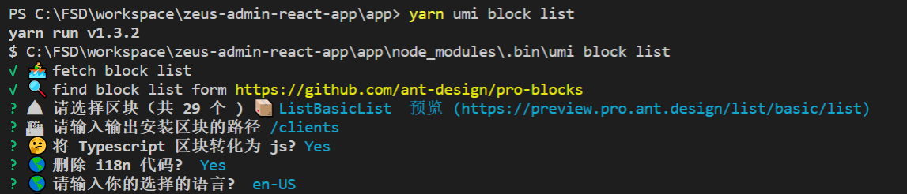

# ZCP Cllien App (For end user customers)

## Deployments

### For Test Enviroment

\*\* Be sure to do `yarn build` first

`yarn build`

followed by

`firebase deploy --only hosting:test`

### For Live Enviroment

\*\* Be sure to do `yarn build` first

`yarn build`

followed by

`firebase deploy --only hosting:live`

## Setup

To change the hostUrl of the React App Navigate to src -> pages -> hostUrl.jsx

# Ant Design Pro

This project is initialized with [Ant Design Pro](https://pro.ant.design). Follow is the quick guide for how to use.

## Environment Prepare

Install `node_modules`:

```bash
npm install
```

or

```bash
yarn
```

## Provided Scripts

Ant Design Pro provides some useful script to help you quick start and build with web project, code style check and test.

Scripts provided in `package.json`. It's safe to modify or add additional script:

### Start project

```bash
yarn start
```

### Build project

```bash
yarn build
```

### Check code style

```bash
npm run lint
```

You can also use script to auto fix some lint error:

```bash
npm run lint:fix
```

### Test code

```bash
npm test
```

### Adding new page

Run the command below in a new terminal if one is already running

```bash
yarn umi block list
```

This will list out all the available umi blocks that we can see on the Pro ant design pages. See the list of blocks here https://preview.pro.ant.design/dashboard/analysis

Refer 

### List of Icons

We are using react-icons to manage all icons, see this link for refrence https://react-icons.netlify.com/#/

## Short Code for React Arrow Function

rafce

## Plugins to Install

Prettier (Don't install Beautify)
